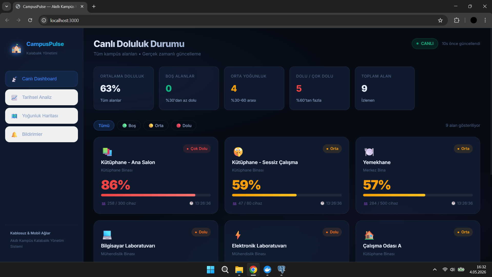
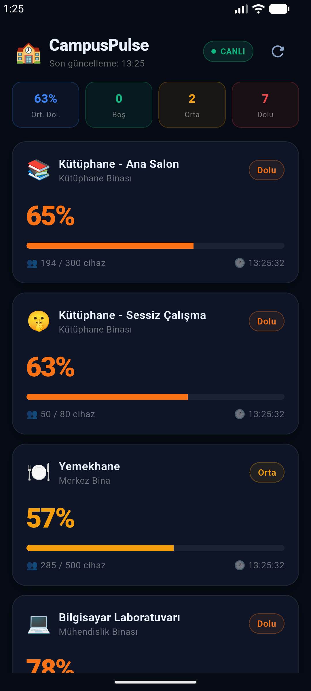
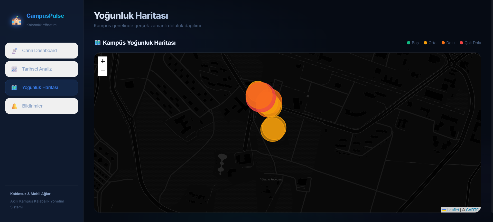

# 🏫 CampusPulse — Akıllı Kampüs Kalabalık Yönetim Sistemi (DEMO)

> [!IMPORTANT]
> **BU BİR DEMO PROJESİDİR.** Veriler gerçek Wi-Fi erişim noktalarından değil, `data-collector` servisi tarafından üretilen gerçekçi simülasyon verilerinden oluşmaktadır.

## 📸 Ekran Görüntüleri

| Web Dashboard | Mobil Uygulama | Yoğunluk Haritası |
|---|---|---|
|  |  |  |

---

## 🗂️ Proje Yapısı

```
crowd-management-system/
├── backend/                  # FastAPI REST API + WebSocket
│   ├── main.py
│   ├── database.py           # SQLAlchemy modelleri
│   ├── seed_data.py          # 9 kampüs alanı başlangıç verisi
│   ├── routers/
│   │   ├── areas.py
│   │   ├── occupancy.py
│   │   ├── notifications.py
│   │   └── websocket_router.py
│   ├── services/
│   │   ├── occupancy_calculator.py
│   │   └── fcm_service.py    # Firebase FCM (mock/gerçek)
│   └── tests/
│       └── test_api.py
├── data-collector/           # Wi-Fi AP polling servisi
│   ├── collector.py          # 60s aralıklarla veri gönderir
│   └── mock_generator.py     # Gerçekçi simülasyon
├── frontend/                 # React Web Dashboard
│   └── src/
│       ├── components/
│       │   ├── LiveDashboard.jsx    # WebSocket canlı kart grid
│       │   ├── OccupancyCard.jsx    # Doluluk kartı
│       │   ├── OccupancyChart.jsx   # Recharts grafik
│       │   ├── HeatMap.jsx          # Leaflet harita
│       │   └── NotificationPanel.jsx
│       └── services/api.js
├── mobile/                   # Flutter Android/iOS/Web uygulaması
│   └── lib/
│       ├── main.dart
│       ├── screens/
│       │   ├── home_screen.dart
│       │   └── area_detail_screen.dart
│       ├── widgets/occupancy_card.dart
│       └── services/api_service.dart
└── docker-compose.yml
```

---

## 🚀 Hızlı Başlangıç (Docker ile Çalıştırma)

Sistemi en hızlı şekilde ayağa kaldırmak için Docker Desktop'ın çalıştığından emin olun ve terminalden şu komutu girin:

```bash
docker compose up --build -d
```

Bu komut şunları yapar:
1.  **PostgreSQL**: Veritabanını başlatır.
2.  **Backend**: FastAPI uygulamasını derler ve başlatır.
3.  **Frontend**: React Dashboard'u derler ve Nginx üzerinden yayına alır.
4.  **Collector**: Sahte veri üreten Python servisini başlatır.

**Erişim Linkleri:**
- 🖥️ **Web Dashboard**: [http://localhost:3000](http://localhost:3000)
- ⚙️ **API Docs**: [http://localhost:8000/docs](http://localhost:8000/docs)
- 🐘 **pgAdmin (Opsiyonel)**: Kendi masaüstü pgAdmin uygulamanızla `localhost:5432` üzerinden bağlanabilirsiniz.

---

## 🛠️ Geliştirme Modunda Çalıştırma (Manuel)

Eğer Docker kullanmadan tek tek çalıştırmak isterseniz:

```
Wi-Fi AP Simülatörü
        ↓ (her 60s)
FastAPI Backend (:8000)
    ├── REST API  → /areas, /occupancy/live, /occupancy/history
    ├── WebSocket → /ws/live (her 10s broadcast)
    └── FCM       → Push bildirimler
        ↓
  ┌─────────┬──────────┐
  │         │          │
React Web  Flutter   Push
Dashboard  Mobile    Notif.
(:3000)
```

---

## 📡 API Endpoint'leri

| Method | Endpoint | Açıklama |
|--------|----------|----------|
| `GET`  | `/areas/` | Tüm kampüs alanları |
| `GET`  | `/areas/{id}` | Alan detayı |
| `GET`  | `/occupancy/live` | Anlık doluluk (tüm alanlar) |
| `GET`  | `/occupancy/history?area_id=1&days=7` | Tarihsel veri |
| `POST` | `/occupancy/ingest` | Collector → veri gönder |
| `POST` | `/occupancy/ingest/bulk` | Toplu veri gönder |
| `POST` | `/notifications/subscribe` | Bildirim aboneliği |
| `DELETE`| `/notifications/subscribe/{id}` | Abonelik iptali |
| `WS`   | `/ws/live` | Gerçek zamanlı akış |

---

## 🎨 Özellikler

- **Gerçek Zamanlı**: WebSocket ile anlık doluluk güncellemesi
- **9 Kampüs Alanı**: Kütüphane, Yemekhane, Lab, Çalışma Odaları, Sınıflar
- **Akıllı Simülasyon**: Zirve saatleri, gece sakinliği, hafta sonu azalması
- **Renk Kodlama**: 🟢 Boş / 🟡 Orta / 🟠 Dolu / 🔴 Çok Dolu
- **Tarihsel Analiz**: Recharts ile 1/3/7 günlük trend grafikleri
- **Isı Haritası**: Leaflet.js ile kampüs haritası
- **Push Bildirimler**: FCM entegrasyonu (mock mod dahil)
- **Flutter Mobil**: iOS + Android + Web desteği
- **Docker Compose**: Tek komutla tüm sistem

---

## 🧪 Testleri Çalıştır

```bash
cd backend
pytest tests/ -v
```

---

## 🔒 Gizlilik

- MAC adresleri **SHA-256** ile hashlenip anonimleştirilir
- Ham MAC adresi asla saklanmaz
- KVKK uyumlu

---

## 📚 Ders: Kablosuz ve Mobil Ağlar

Bu proje şunları göstermektedir:
- Wi-Fi AP'lerden veri toplamanın pratik yöntemi
- Kablosuz ağ verisiyle doluluk tahmini
- Gerçek zamanlı iletişim (WebSocket, Push)
- Mobil uygulama geliştirme (Flutter)
- Ölçeklenebilir mikroservis mimarisi
